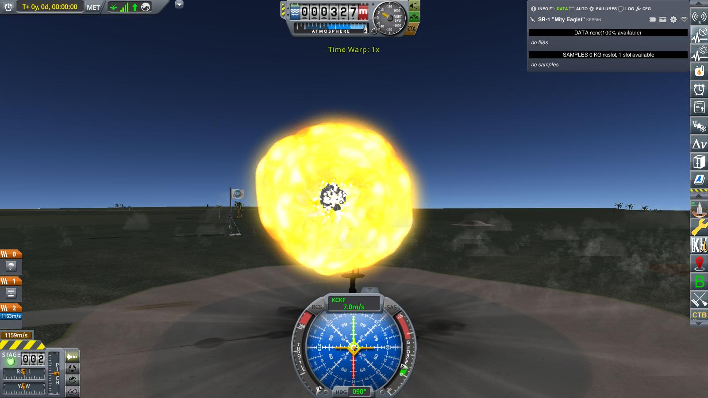

# Year 1, Day 5: SR-1 "Mity Eaglet"

Five days after KSA embarked on their mission to guide Kerbalkind to the stars,
their first rocket sits on the launch pad, ready to fly. 

The "Sounding Rocket No. 1" (SR-1 for short). Nicknamed the "Mity Eaglet",
because it basically consists of the newly developed experimental
atmospheric guidance/landing engineering testbed ("Eaglet") bolted to the "Mite"
solid rocket booster (nicknamed both for its size, and because it "might actually
work"). A compromise — too small to get to space (actually, too small to get
much higher than a modern airplane, let alone a balloon), and a solid
fueled rocket instead of the potentially way more powerful (but alas, way more
complicated as well) liquid fuelled engine the KSA was developing. But it could
be built fast (and cheap, a not unimportant consideration given the state of the
societies' finances), the data that would hopefully be gathered from the
flight was needed, and expectations were high for the Kerbinian Society for
Astronavigation to actually navigate something if not to, then at least toward
the stars.

Prelaunch tests on the pad were successful: Telemetry recorded and transmitted,
transmitter in good order (obviously), internal electrical battery nominal. All
systems go, all personnel safely either in the observation bunker or in mission
control (and spectators actually atop mission control, thanks to its flat roof
and good view of the launch pad). SR-1 ready for launch.

Ignition! Launch clamps free! We have lift— **KABOOOM!!!!**

Not five meters off the pad, SR-1 blew up in a big fireball.

A "thrust instability", the failure analysis concluded some time later. And of
course, a huge disappointment and a rather severe setback for the Kerbinian
Society for Astronavigation.

But miraculously, the experimental atmospheric guidance/landing engineering
testbed survived the explosion almost completely undamaged, and even manged to
send back the flight data of the not-quite-one-second-long flight.

And miracle of miracles, the Experimental Engineering Group actually paid out
the 2000 funds prize they promised for getting a rocket 
_at least 200 meters off the ground!_ Nobody in the society knows why.
Rumour has it some accountant at the EEG confused "above ground" and "above sea
level". But nobody wants to investigate, really. Gift horses and all. Don't stir
the sleeping dogs. At least, the society did not lose too much funds from the
debacle (they actually turned a small profit).

