# Year 1, Day 132: WIMAS-I

Not even one minth after the launch of Pathfinder IV (12 days, one hour and four minutes, to be overly exact), another Sandstone/Satevis launcher sits on the pad. Ready to launch the first weather imaging satellite — or WIMAS-I for short.

Tension is high in mission control, because this launch again has a number of "firsts":

* Instead of launching into a highly elliptical equatorial orbit as in the previous missions, WIMAS-I will (hopefully) launch into a low, circular, polar orbit (so that it can eventually observe the weather all over Kerbin).
* WIMAS-I is much heavier and much more complicated than the previous satellites. It even has a computer built in, and this computer can even be reprogrammed in flight!
* In order to accommodate both the more massive satellite and the added Delta-V needs for a polar orbit, the Satevis stage will not have a dedicated controller aboard. Instead, the flight software for the launch phase will run on the WIMAS computer, and will be replaced remotely with the software for station keeping and scientific observations once in orbit (because — powerful as it is — the WIMAS computer nonetheless has not enough storage space to hold both the launch and the orbital software).

Especially the last point makes the launch team nervous. But the alternative — haul both WIMAS-I and the tried-and-true Satevis control module into orbit, each with their own computers — simply exceeds the mass budget for the Sandstone/Satevis lifter.

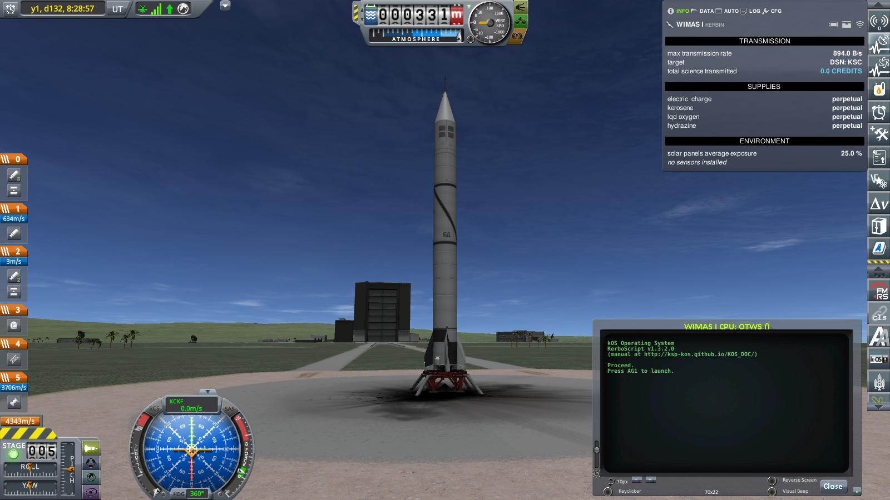

In order to maximize the illuminated area of Kerbin that WIMAS-I will observe on half of each orbit, the launch is scheduled for noon. At exactly 09:00:00, mission control gives the launch command:

> _Ignition!_

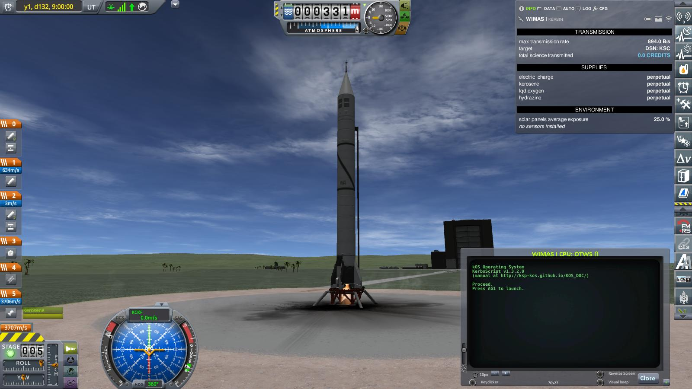

> _Launch clamps free!_

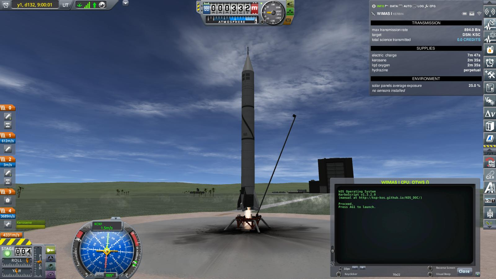

> _We have liftoff!_

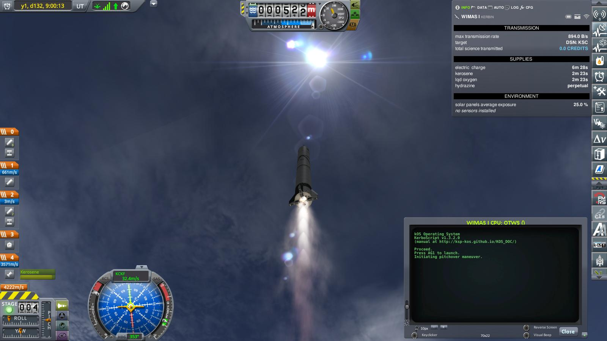

The Sandstone booster carrying WIMAS-I roars into the slightly overcast sky, and — for the first time — pitches north (and even a little bit west) instead of east.

The adapted flight software automatically adjusts the azimuth direction so that the final orbit will have an inclination of 90° — at least, that is what everyone im mission control hopes.

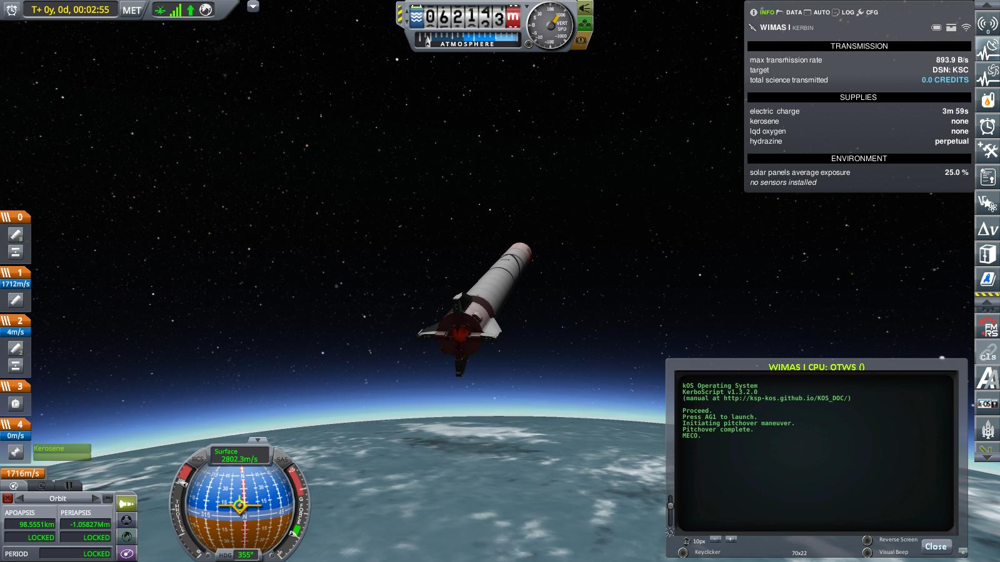

At the usual altitude of round about 60km, the fuel of the Sandstone booster is exhausted and the main engine cuts off. The new azimuth control software has worked perfectly so far.

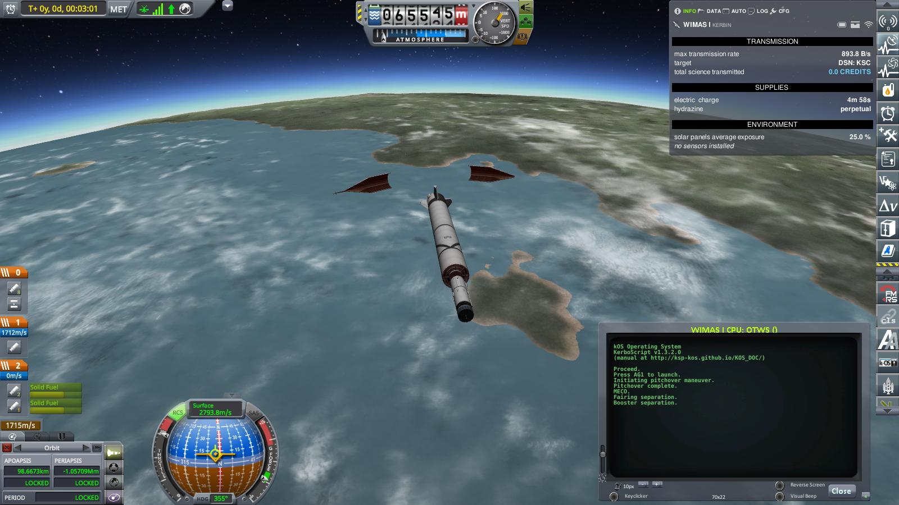

At an altitude of 65 km, fairings are separated to expose the Satevis upper stage, and the spent Sandstone booster is jettisoned. Almost routine. But this time, the big island that the mission just passed is _not_ Welcome Back Island.

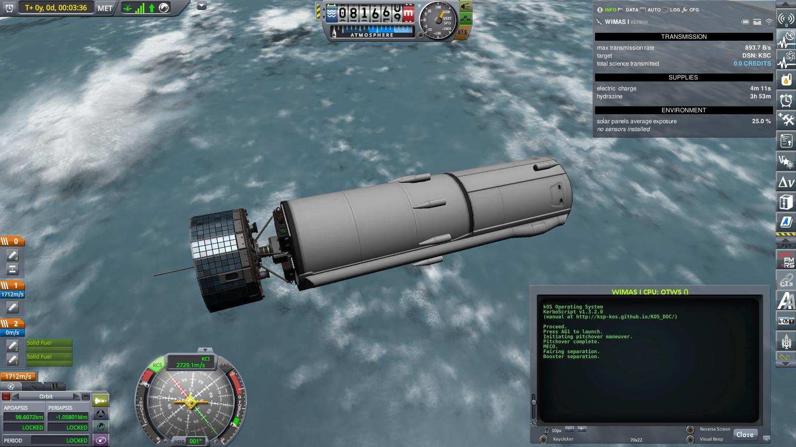

WIMAS-I atop the Satevis stage coasts to an Apoapsis of 95 km. The extra batteries on the Satevis are needed to feed the power hungry computer during launch.

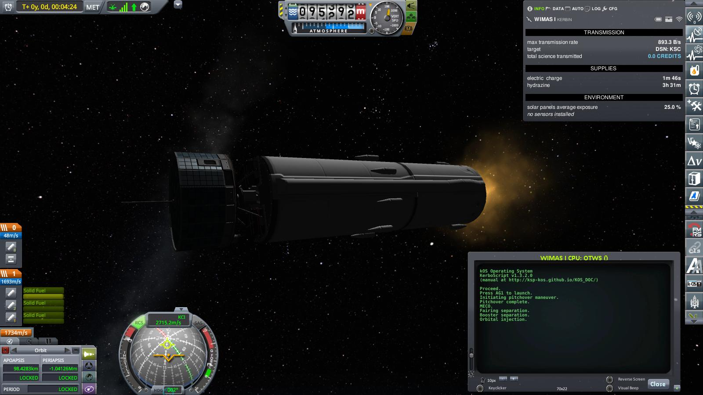

Shortly before reaching apoapsis, the Satevis upper stage ignites as planned.

In contrast to previous missions, this time — instead of just pointing prograde and hurling the payload as high as possible — the flight software makes sure that the apoapsis does not increase too much. And it cuts of the engine as soon as the orbit is circular (which is possible thanks to the ingenious engineers at Bluedog Design Bureau who came up with a system to stop a solid rocket before it runs out of fuel).

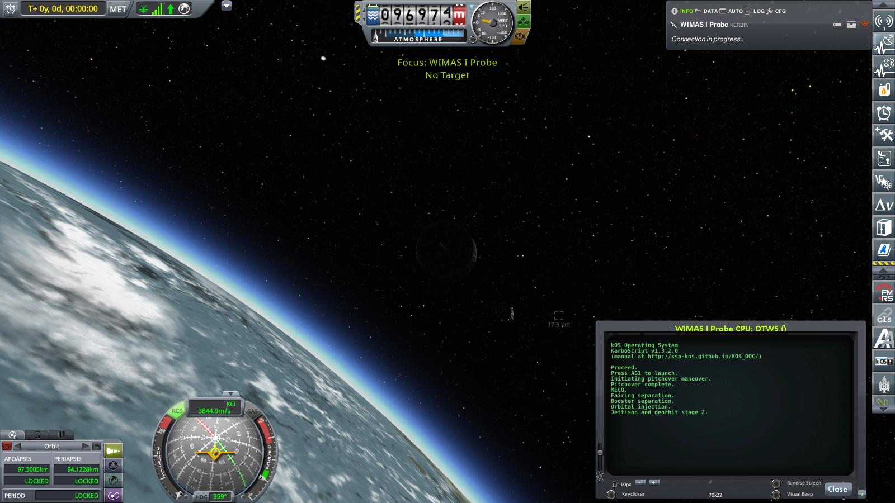

After reaching an almost perfect orbit (94 by 97 km, with an inclination of almost exactly 90°) the flight program cuts of the Satevis engine, and triggers both the small explosive charge that separates WIMAS-I from the Satevis and a set of eight small, solid, retro rockets on the Satevis that will deorbit the Satevis upper stage.

The launch team in mission control takes a collective, relieved, deep breath. Their job is done, and flawlessly. After handing control of WIMAS-I over to the payload team, the next to last item left on the agenda for the launch crew is to watch the — now uncontrolled — Satevis stage deorbit on the telemetry monitors.

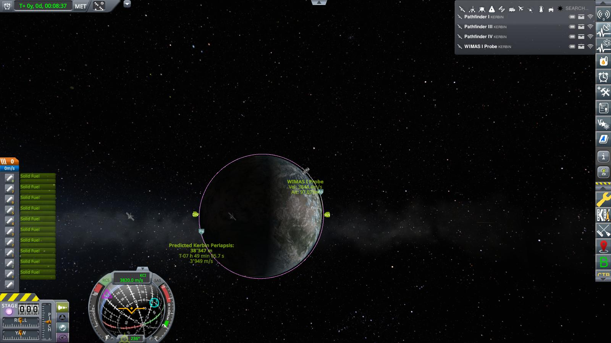

The spent Satevis stage may now be uncontrolled, but definitely _not_ out of control. The push from the retro rockets has lowered the periapsis — exactly as planned — just enough that it will reenter the atmosphere shortly after passing the north pole, paint a fiery streak over the northern ocean and either burn up shortly before reaching the equator (probably) or fall into the ocean a bit south of the eastern tip of an arid equatorial coastal mountain range (not as probable, but possible).

In any case, it will provide spectacular fireworks for a small crew of local radio (and space!) enthusiasts which are currently sitting high on a peak in said arid mountain range on behalf of the Kerbinian Society for Astronavigation, crewing the so called "off-site tracking station" (which consists of a portable — barely — antenna dish and radio, a portable — just as barely — generator, and a small cluster of tents) that provides the telemetry data currently scrolling over the monitors at KSC.

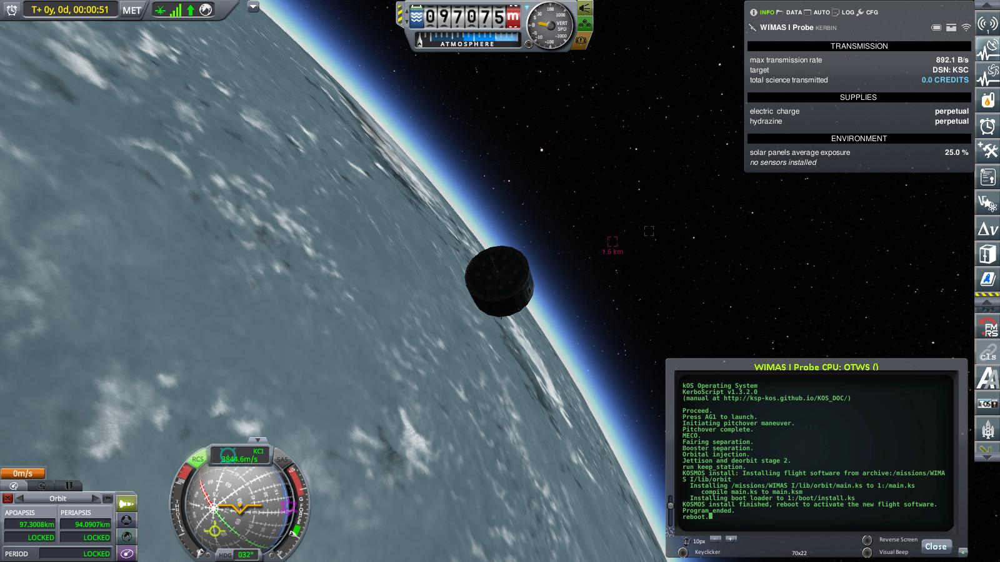

Meanwhile, the payload team gets to work. The first item on their agenda is to replace the launch flight software with a program that will keep the satellite oriented so that its top — covered with solar panels — always points to the sun (the sides are also covered with solar panels, but that is mainly a precaution to make sure that WIMAS-I does not immediately run out of electricity if it is not pointing at the sun).

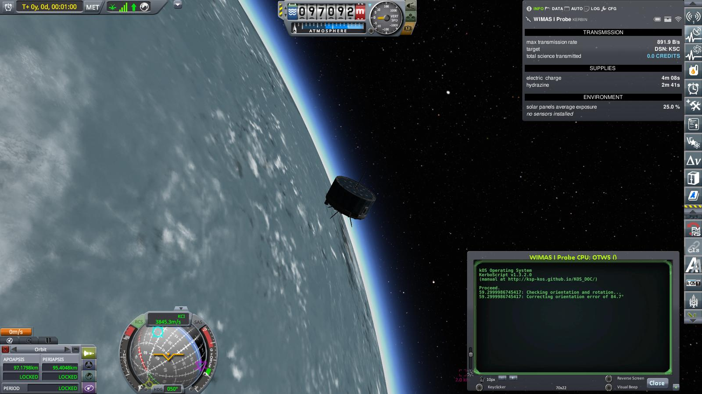

The newly installed station keeping software boots up, detects that WIMAS-I is way out of alignment, and fires both RCS and reaction wheels to correct the error.

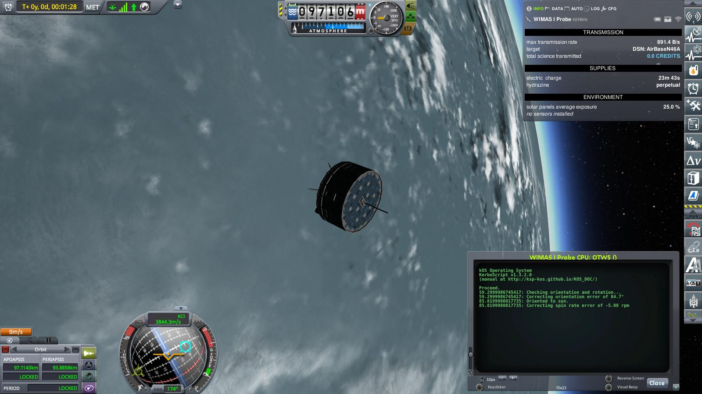

As soon as the axis of WIMAS-I stabilizes pointing to the sun, the station keeping software proceeds to spin it up to exactly 5 rpm. Fast enough to stabilize its orientation, slow enough to not blur the camera images.

From now on, the station keeping software will run in an endless loop, wake up every minute, check orientation and rotation speed, correct errors if necessary (using just the reaction wheels if the error is small enough, conserving the RCS fuel for unforeseen circumstances), and go back to sleep again. This will typically just take a few seconds, and leave most of the resources — especially the electricity produced by the solar cells — free for WIMAS-I's primary task: Observing the weather on Kerbin. From Space.

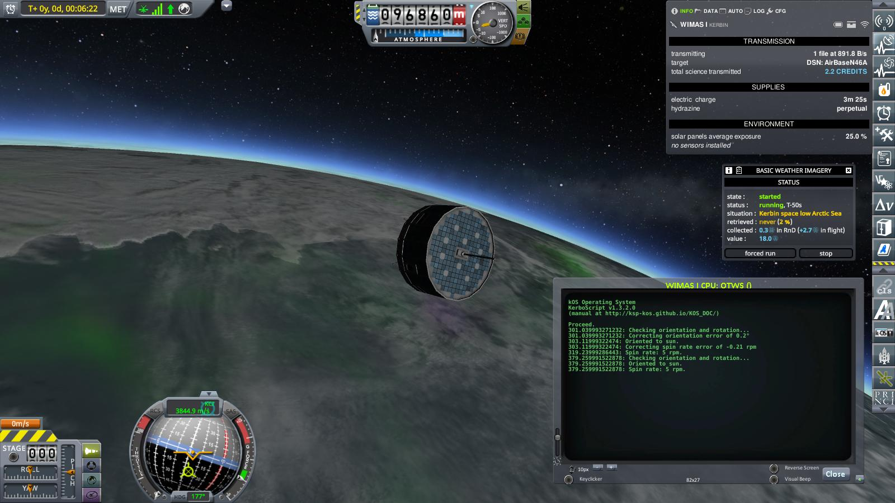

And already the first image sent back to the science team proves out to be sensational: Not only a clear image of wispy clouds over the northern ocean off the polar ice shelf, but a an equally clear image of the northern aurora!

As the launch team heads out of mission control to get to their last checklist item for the day (which is, of course, to repair to the cantina for a well earned celebratory snack), they hear in passing the preliminary discussions between the WIMAS-I and the Pathfinder science teams about a joint research program to further study the influence of the radiation fields around Kerbin on its atmosphere, focusing on the northern and southern aurorae.