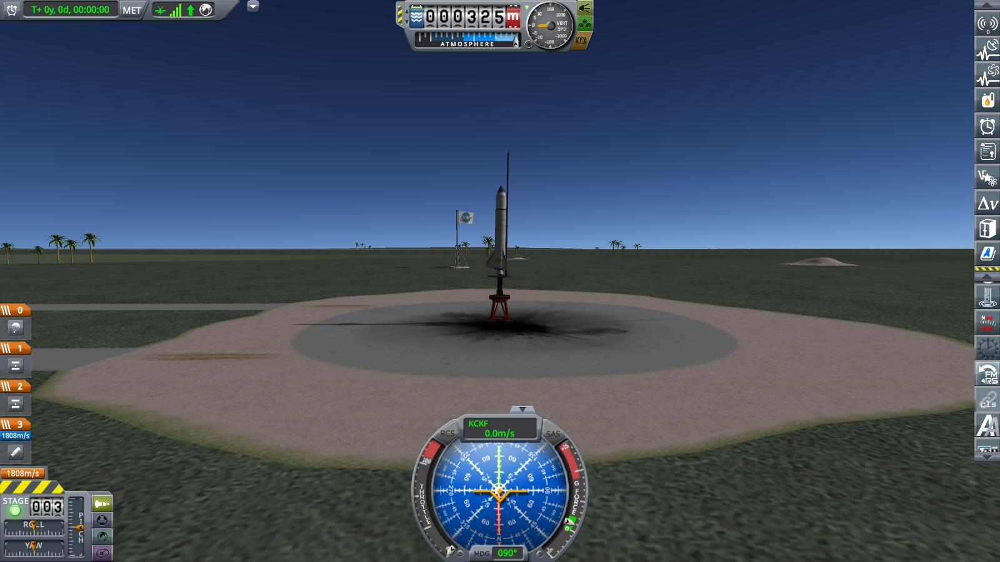
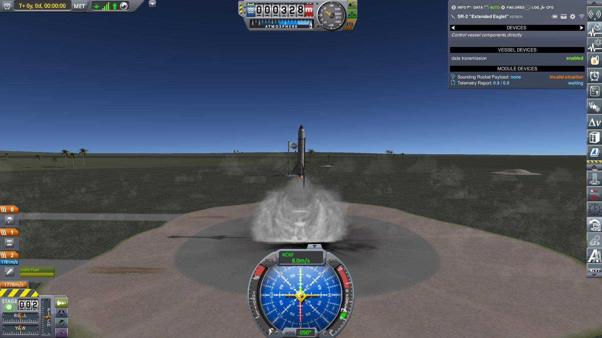
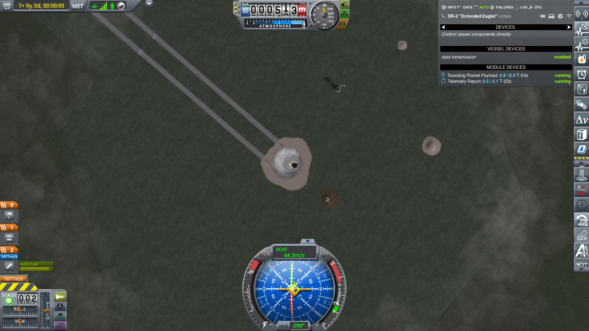
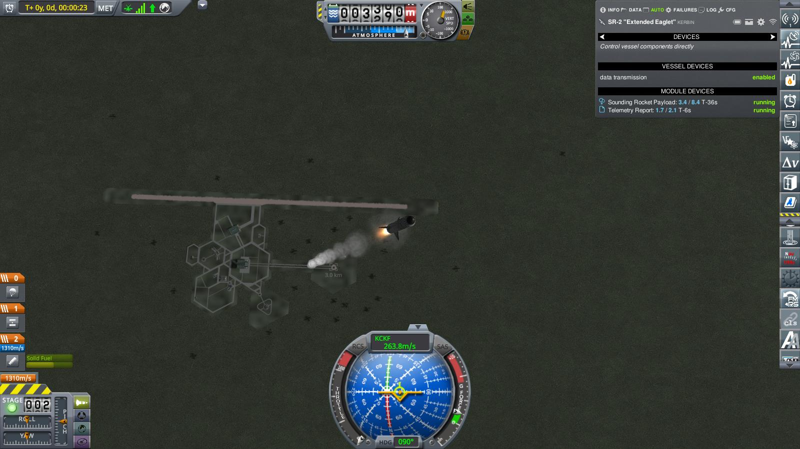
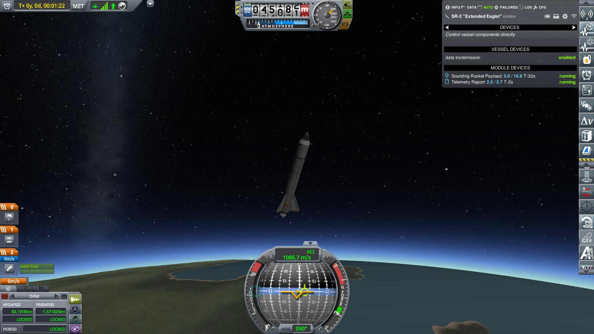
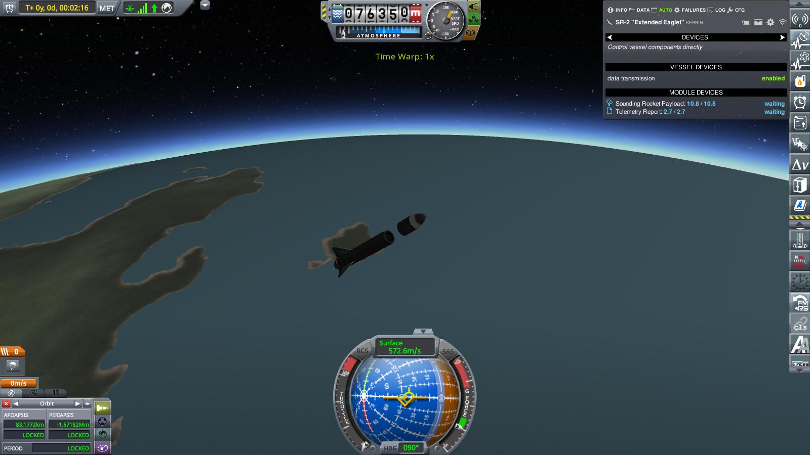
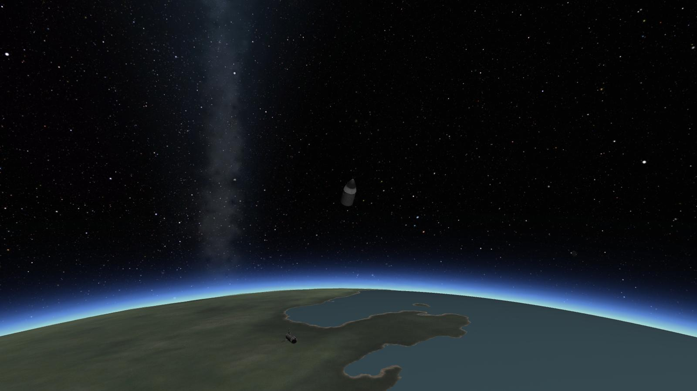
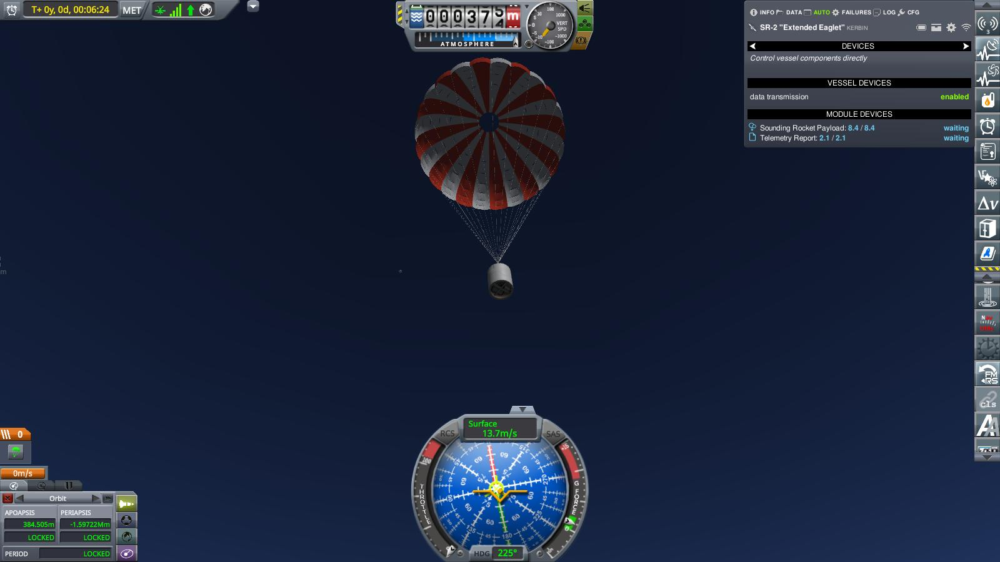
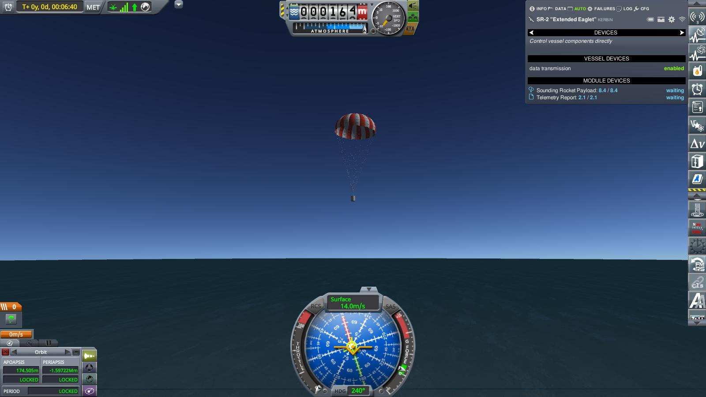

# Year 1, Day 16: SR-2 "Extended Eaglet"

The explosion of SR-1 led to some debates within the society. Note to give
up, of course, but how to go on. 

Valentina, Robert, Mortimer and Gene proposed a cautious course and to re-do
SR-1, while Max and Wernher wanted to accelerate development on the liquid fuel
engine and fly that on the next launch. Surprisingly, Jeb did _not_ push for
going all-out, but instead proposed a compromise: Do another flight with the
Eaglet, but use a bigger — albeit still solid — booster. That compromise was
readily accepted. One deciding factor might have been that the Experimental
Engineering Group offered not one, but two new prizes: One for reaching the
upper atmosphere, and another, _very_ substantial prize for reaching space.

As a result, at midmorning eleven days later, the sounding rocket number two is
rolled out to the launch pad. Of course, nobody calls it that - it is either the
"SR-2" (because everybody loves acronyms), or the "Extended Eaglet" (because
building the thing was exhausting enough that no one had the energy — or the
inclination — to come up with a witty nickname).

SR-2 is not much different from SR-1: The "Eaglet" core — or rather "an Eaglet
core", the original one that survived the SR-1 explosion turned out to have
taken some damage after all and was no longer flight worthy — atop a solid
booster. A "Shrimp", this time (because shrimps are a bit bigger than mites),
but still basically the same: A tube filled with explosives, with a central hole
where the fire would burn, and a hole at the end where the hot gas could escape.

The other modification worth noting was on the Eaglet core itself: Two more
slots for material experiments, and increased data storage, in anticipation of a
rich return of scientific and engineering data from the lower and upper
atmosphere, and possibly even from space.

Prelaunch checks completed, launch site evacuated, all personnel accounted for.
At 001/016 07:22:42, Gene Kerman in mission control issues the launch command

> _Ignition! Launch clamps free! **WE HAVE LIFTOFF!!!!**_

The cheers from mission control drown out even the roar of the booster, as SR-2
lifts off the pad in a huge column of smoky exhaust.

As if fate wanted to compensate for the SR-1 disaster, the flight went off
without a hitch. At an altitude of about 45 km, the booster burned out. It had
been decided early on to keep the spent booster for a while, in order to profit
from the added aerodynamical stability provided by the fins.

T+2:16. Booster separation at an altitude of 76350 m. As near to space as makes
no difference — telemetry no longer reported any aerodynamic effects. And still
climbing at a good clip. 

Across the 80 km mark. SR-2 had officially entered space, as defined by the
World Record Keeping Society (not that there was much difference to 76 km).
Telemetry still trickled in, indicating that the onboard experiments were
gathering data. The Eaglet had acquired a a slight rotation within the
flight plane, but this would hopefully be stopped by aerodynamic forces once
back in the atmosphere. 

A couple of tight moments after the (expected) loss of communication with SR-1
on reentry, and then

> _Telemetry, Flight: Reacquired radio contact. SR-2 core still rotating, but
> dampened._ \
> _Telemetry, Flight: Parachutes deploying. Rotation dampening further._ \
> _Telemetry, Flight: Parachutes deployed in drogue configuration._ \
> _Telemetry, Flight: Parachutes fully deployed, rotation stopped._ \
> _Visual Observation, Flight: Confirm parachute deployment. We can see the Eaglet!_

SR-2 "Extended Eaglet" is almost back to Kerbin.

**Almost**. But then:

> _Telemetry, Flight: Something is off with the parachute..._ \
> _Visual Observation, Flight: Parachute collapsed! Repeat, 'chute collapsed!!_ \
> _Telemetry, Flight: We lost contact!_

Analysis of the last seconds of telemetry and the telescope images revealed a
problem with the reefing cutters. Apparently, the small charges used to cut the
reefing lines to go from drogue configuration to full deployment had damaged the
canopy, which caused the parachute to tear later in the flight.

And they never found a single piece of SR-2. They searched, of course. But it
almost seemed as if the Kraken — the mythological creature which according to
seafarers' lore swallowed whole ships on the high seas — had swallowed SR-2 as
well. 
