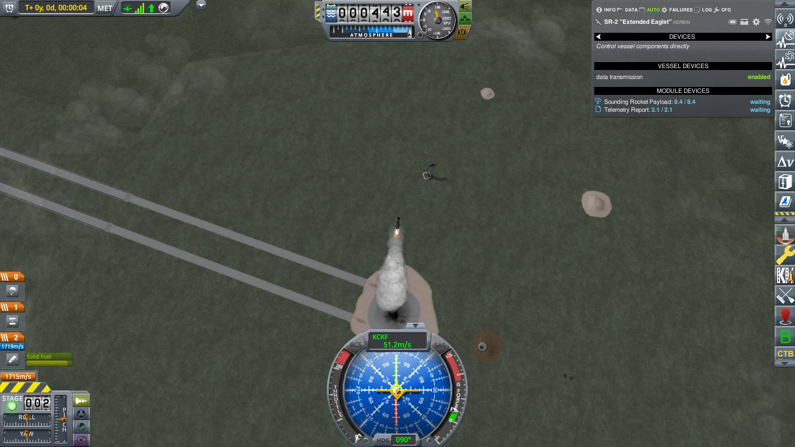
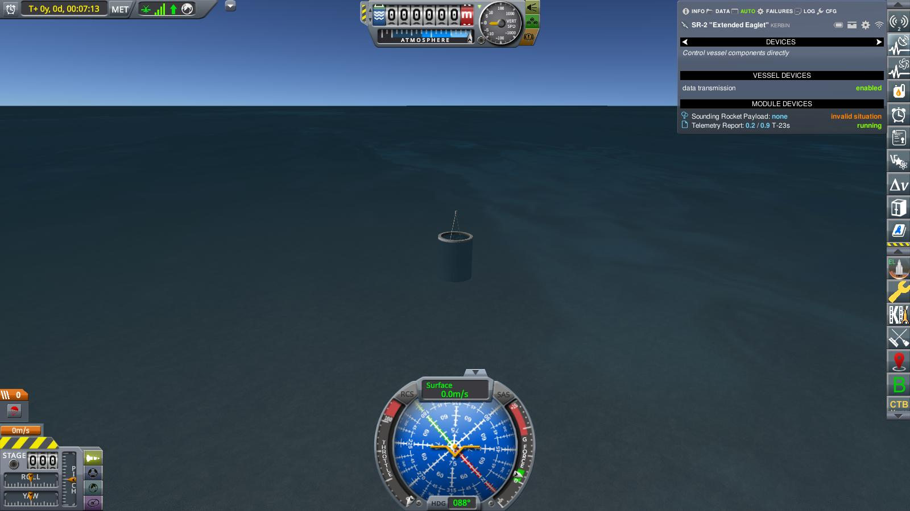

# Year 1, Day 26: SR-2 "Extended Eaglet" revisited

Another launch, another — not, not really failure, much less debacle. Yes, SR-2
did not make it back, and valuable scientific and engineering data was lost. But
SR-2 _did_ fly, it _did_ reach space, and it _almost_ made it safely back to
Kerbin. That gave the society the confidence to not only try another SR-2 launch in
almost the same configuration, but to accept another challenge by the
Experimental Engineering Group: Fly a vessel to space and recover it safely.
After all, they had almost done it before. 

The only difference to the first SR-2 mission was a slightly steeper launch
angle, because telemetry from the earlier flight indicated that the time
spent outside the atmosphere had been a bit too short to complete the
materials experiment on board SR-2. Hopefully, the steeper launch angle would
ensure enough time in space.

So, ten days after the first SR-2 flight, another SR-2 has been rolled out to
the launch pad:

> _Ignition! Launch clamps free! We have liftoff!_

It almost starts to seem like routine...

But alas, about thirty seconds into the flight:

> _Telemetry, Flight: We read unusual thrust values._ \
> _Flight, Trajectory: Are we still on course?_ \
> _Trajectory, Flight: Slight deviation, still within error margins._ \
> _Flight, all: We are still go for the mission_.

and some seconds later:

> _Telemetry, Flight: We read zero thrust, repeat zero thrust!_ \
> _Visual Observation, Flight: We see an explosion!_ \
> _Telemetry, Flight: We still have contact to SR-2_ \
> _Flight, all: Mission abort, repeat, mission abort!_ \
> _Flight, all: But let's try to recover the probe core if possible._

Almost two minutes later, SR-2 safely touched down not far from KSC. 

Another failure! But at least not without a silver lining: At least the flight
data and engineering experiments for the early flight phase had been recovered.
And after a quick inspection, the Eaglet actually proved out still flight
worthy. This made it possible to quickly mount it onto another booster, and
attempt another launch on the same day!

Not without sacrifices, of course. Lunch, first and foremost — there was barely
time to grab some snacks on the run as the whole society scrambled to mount the
recovered probe on another booster and roll it out to the pad again.

But early in the afternoon, the re-built SR-2 is ready for launch again.

> _Ignition! Launch clamps free! We have liftoff!_

This time, everything went smoothly. Booster burnout at T+00:59. Payload
separation at T+01:43 (as before, the flight plan demanded to hold onto the
spent booster after burnout for the added stability provided by the fins).

Apoapsis at T+03:07 and 97708 m — another first! Nothing kerbalmade ever went
farther from Kerbin!

As on the first flight, the Eaglet probe acquired a slight rotation in the
flight plane, which changed to moderate oscillations around the retrograde
direction on reentry. These dampened out quickly after deployment of the
parachutes in drogue configuration at T+06:10, and were negligible when the
parachute deployed fully at T+06:41

And finally, at T+07:13, on 001/26 10:17:59 on the spot, the Eaglet probe safely
splashed down into the sea, roughly halfway between the mainland coast and
Welcome Back Island.

Finally. Success at last. The undeniable proof that it _was_ possible to reach
space in a rocket, and safely come back to Kerbin again (and another big prize
from the EEG, which certainly helped to further the societies' goals).
