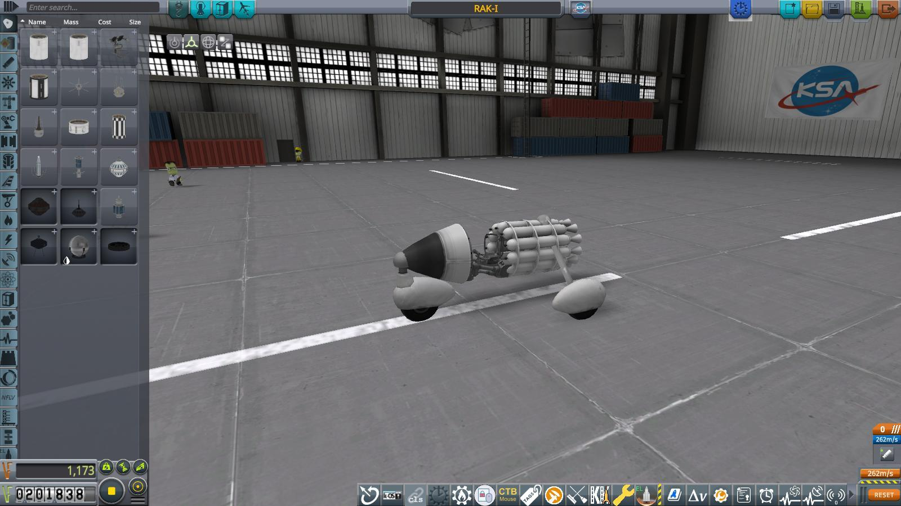
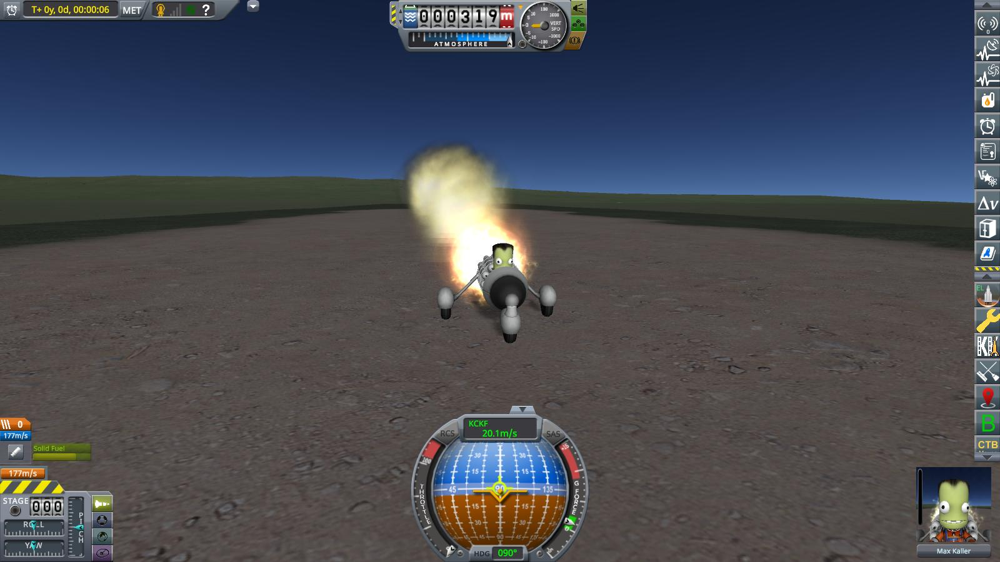
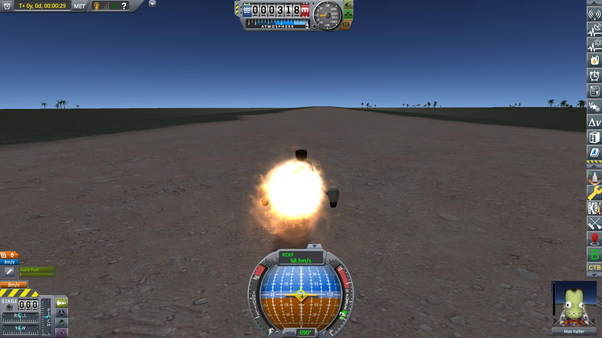
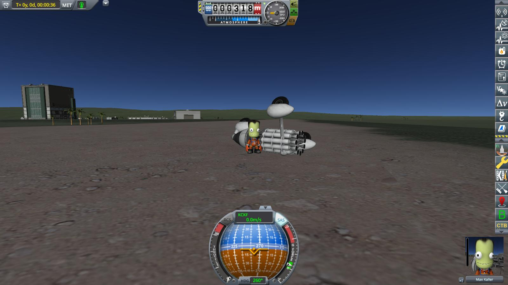

# Year 1, Day 32: RAK-I or "shenanigans of engineers"

For the last ten days, Max and Jeb had been busy in their spare time on a mysterious private side project in the old airport hangar. Now, they were finally ready to present it to the world: The "rocket assisted kar number one", or RAK-I for short.

A tricycle built from spare parts (last but by no means least some old small airplane wheels left over from the previous tenants of the KSC) and powered by a bunch of cheap, small, solid fuel rockets fixed to a circular frame, its express purpose is to reach a speed of at least 200 km/h and break the existing speed record for wheeled vehicles of any kind.

On the morning of 01/32, RAK-I is rolled out to the old runway for a first attempt at breaking the land vehicle speed record. After an inspired game of rock-paper-scissors between Jeb an Max to determine who will drive the RAK-I, the winner (or loser, depending on point of view) Max takes the drivers seat and lights up the circle of rockets.

Thrust has been carefully controlled so that the thrust-to-weight ratio stay safely below 1 (at 0.9, to be precise). Nonetheless, the rockets quickly accelerate RAK-I, and as it passes the hangar, shortly before burnout, it reaches a top speed of 58.5 m/s. Over 210 kilometers per hour — new world record for wheeled vehicles!

Unfortunately, a bump in the uneven old runway, combined with a slightly heavy foot on the brakes on Max' part, conspired to throw a small wrench into the works. The left back wheel of RAK-I shortly leaves the ground, RAK-I starts to slide into a turn and finally rolls over, throwing Max out of the drivers seat in the process.

Fortunately, Kerbal heads are thick, though, and — apart from a short dizzy spell — Max stays uninjured. And on inspection, RAK-I proves to be undamaged as well.

A final photograph memorizes another successful feat of the Kerbinian Society for Astronavigation, even if not quite in their main field of endeavour.

----------------------------------------------------------------------------------
[next](../episode5/story.md)