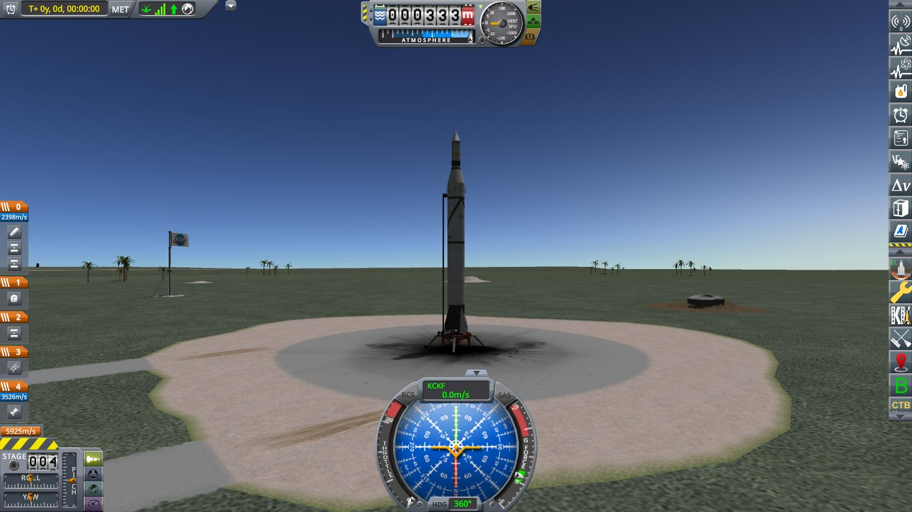

# Year 1, Day 42: Pathfinder I

Finally, the big day. In the assembly building, the crew is busy with the final preparations before the very first attempt to launch an artificial satellite. Aptly named the "Pathfinder". Its goal is to test a hypothesis advanced by noted scientist Kristian Kirbeland, that Kerbin is surrounded by a "belt" of charged particles, held in place by its magnetic field (the fact that the Bloeting Aerospace Corporation offered a substantial amount of money to test that hypothesis might have influenced the decision for this particular scientific goal just a tiny bit).

In fact, this launch will have several firsts: The first rocket with a liquid fueled engine — the very engine that Wernher and his colleagues have been working on for some time now. The fist two-stage rocket. The first rocket that can (and will) be controlled in flight. And the thing that will control it — a "digital computer" — is yet another first.

In short, plenty of opportunities for things to go wrong. No wonder everyone in mission control is a tad nervous as Pathfinder I stands by ready to launch.

The launch has been scheduled for 08:30, because the plan is to stabilize the satellite by rotating it around its longitudinal axis ("spin stabilization", the boffins call this). And launching at 08:30 will make sure that the satellite arrives in orbit exactly at midday and thus will get the maximum possible sunlight on its solar cells (those are _another_ first — as if there were not firsts enough already for this mission).

And of course, something _did_ go wrong. The new liquid fueled engine — vastly more complicated than a solid rocket — failed to ignite and the mission had to be aborted with the rocket still on the pad.

The problem with the engine turned out to be relatively minor, fortunately, and was easily fixed. So, exactly one day later, Pathfinder I is ready for launch again.

> _Ignition! Launch clamps free! We have liftoff!_

Shortly after liftoff, the automated program on the digital flight computer tilts the rocket a tiny bit over to the east.

At the same time, a failure of the second stage separation mechanism is detected. But fortunately, the engineers — being leery of all the new stuff on this flight — built in a redundant separator.

The remainder of the ascent guidance is left to gravity alone.

At T+02:14, the liquid booster stage burns out and is separated automatically by the guidance program. The second stage with the guidance hardware and RCS equipment continues on.

Fairings have been successfully deployed as well.

Shortly before apoapsis, the guidance program prepares the last — and most involved — maneuver: First, the rocket is turned parallel to the horizon to prepare the upper stage for orbital injection. As it is midday here over the ocean east of Welcome Back Island, this also turns the satellite – and especially important its photovoltaic cells — broadside to the sun. Then, the whole vessel is spun around its longitudinal axis to stabilize it in this orientation.

And finally, the flight computer ignites the orbital stage, triggers the reserve separation mechanism, and — mission fulfilled — shuts itself down.

The orbital stage — now again under direct radio control from KSC — continues on, accelerating ever faster...

... until it **REACHES ORBIT**! Kerbin now has a third moon!! **An artificial moon!!!**

That the last decoupler failed again and the new satellite stays stuck to the spent upper stage booster is of little consequence. The radiation experiment will work equally well with the booster attached. And — to quote Wernher von Kerman — "at least the failure has provided us with valuable data".

Pathfinder I ended up in a highly elliptical orbit around Kerbin, with an apoapsis almost half the way to Minmus.

And as it turned out, there was indeed a region of elevated radiation around Kerbin, just as Kristian Kirbeland predicted. In fact, the data indicated that there might even be two such "radiation belts", separated by a region of (comparably) lower radiation.

----------------------------------------------------------------------------------
[next](../episode6/story.md)