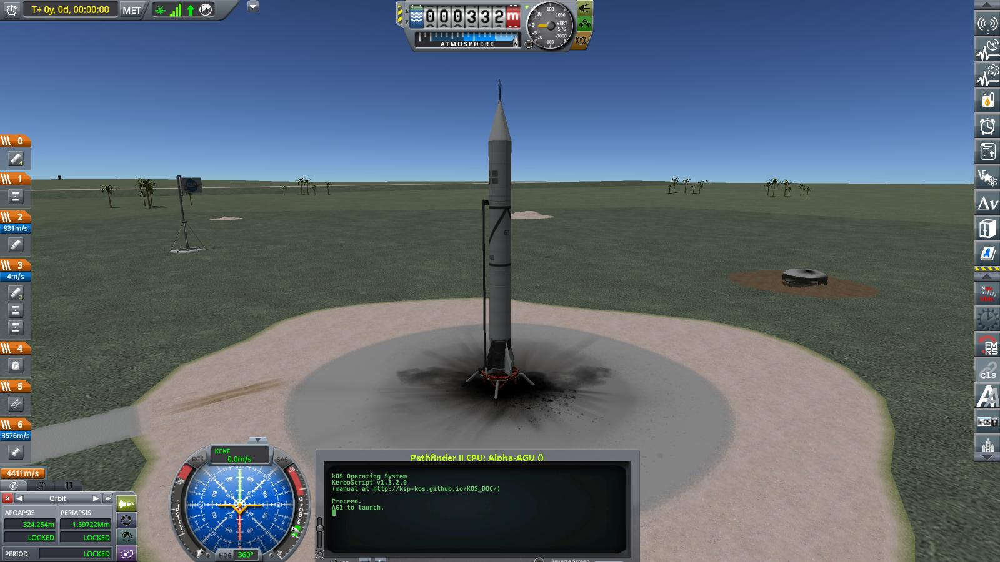
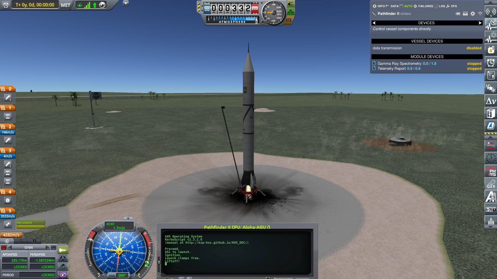
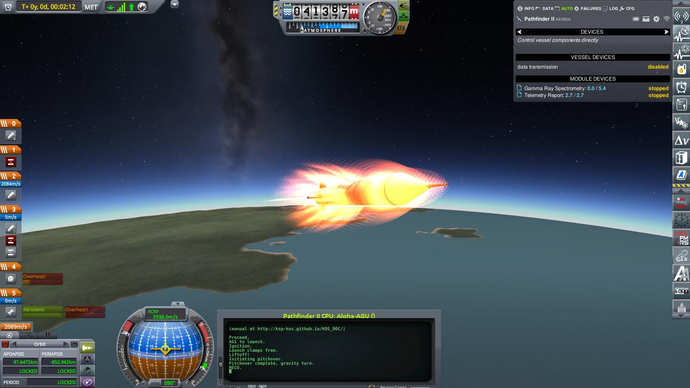
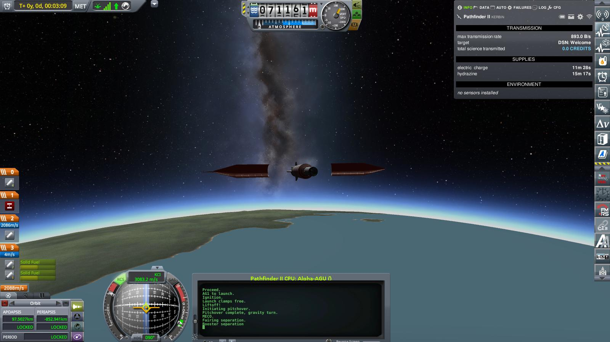
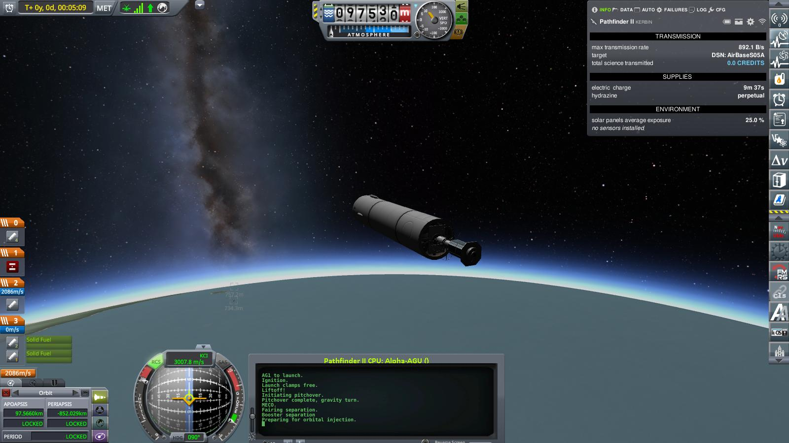
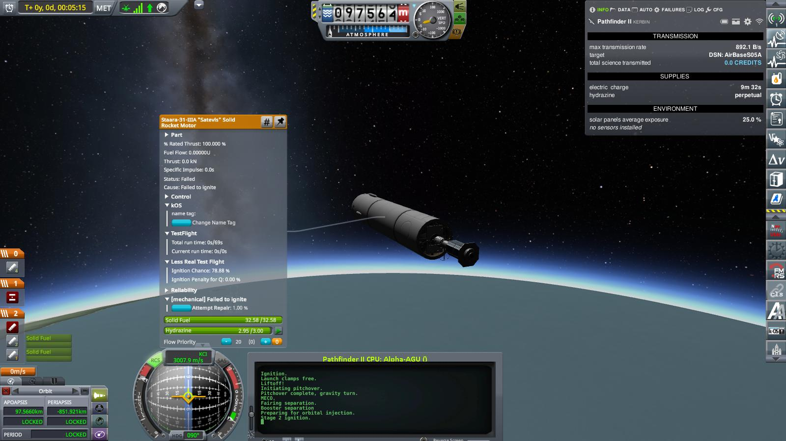
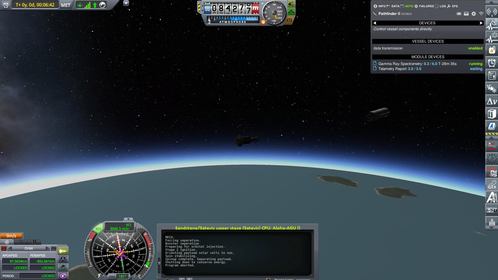
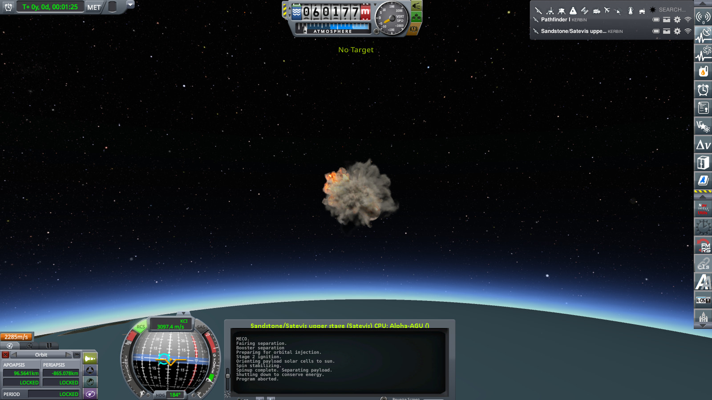

# Year 1, Day 81: Pathfinder II

The huge wave of popularity following the launch of Kerbins first artificial satellite was followed by a notable influx of new members for the Kerbinian Society for Astronavigation. Most of them supporting members, but quite a few decided to dedicate their time fully to the society. Most notably Gus Kerman — an experienced engineer — who took over responsibility for operations, and noted scientist Linus Kerman. Kermans again. Something about the society seemed to really attract people with that last name.

And other organizations took notice as well, and came up with ideas and plans how to use artificial satellites: For monitoring the weather, to create accurate maps of all of Kerbin, even to use satellites for communications, as if they were huge radio towers — suddenly, the possibilities seemed endless. And, of course, for pure scientific research. First and foremost, for further investigation of the newly discovered radiation belt (or belts?) around Kerbin.

For the next munths, three new satellites were planned: Pathfinder II and III to further investigate the radiation environment around Kerbin, with different instruments than Pathfinder I. And finally — commissioned and paid for by the Research Advancement Division, including a substantial advance — a satellite dedicated to the observation of large-scale weather patterns: The "Weather ImAging Satellite" or WIMAS (actually, WIMAS I — there were already plans for more).

The two new Pathfinders would be launched on a modified version of the rocket that successfully delivered Pathfinder I to orbit: The same "Sandstone" first stage, but instead of the conical interstage with integrated avionics and attitude controls topped by a "dumb" upper stage consisting only a simple solid booster, the payload, and a small fairing to protect the payload, the new version (called unimaginatively the "Sandstone/Satevis" after its main components) would use a more sophisticated upper stage (albeit still a solid rocket as those were more dependable) with integrated attitude control, and put the avionics core on the second stage. And employ a bigger fairing to protect both the payload and the second stage.

And finally, WIMAS I — which would be quite a bit bigger and heavier than the Pathfinders — would launch on yet another modification of this new launch vehicle: With an additional tank segment on the Sandstone stage, and no avionics on the Satevis upper stage because WIMAS I was big enough to accommodate a digital computer on the satellite itself, which could be used both for the launch and later on for precise attitude control in orbit.

The flight plan for the two new Pathfinders will be similar to that of Pathfinder I: Delivery into a highly elliptical, equatorial orbit that will hopefully cross the newly discovered radiation belt (belts?) around Kerbin. But instead of spin-stabilizing the second stage along the direction of flight at second stage ignition, the more sophisticated Satevis upper stage will orient its payloads axis normal to the orbital plane, and _then_ spin up to stabilize the satellites' orientation. And finally, after separation from the payload, the Satevis stage will coast to apoapsis, orient itself prograde, and fire four small solid retro rockets to safely deorbit.

And now, 38 days after the historical flight of Pathfinder I (and exactly three minths after its first attempted launch), Pathfinder II sits on the pad, ready to implement this plan.

> _Ignition! Launch clamps free! We have liftoff!_

The ascent through the atmosphere is almost routine now: Shortly after liftoff, the flight software tilts the Sandstone rocket over a couple degrees to the east, and then lets gravity and aerodynamics guide it. Alas (almost routine now as well), shortly after liftoff, telemetry reports problems with some of the stage separators. One should be no problem (like on Pathfinder I, there is a second, redundant stage separator), and the other should hopefully still work.

At T+02:12, the Sandstone engine cuts out as planned.

 The empty stage is kept for a while, until it is safe to discard the fairing and expose both payload and second stage to the rarified atmosphere.

At T+05:09, the flight software aligns the Satevis stage for orbital injection, and triggers the ignition.

... but nothing happens. Ignition failure!

Dejected faces all around mission control. Without the upper stage, the mission is doomed, and Pathfinder II will inevitably crash down onto Kerbin again.

Ironically, the rest of the flight plan executes flawlessly: After detecting no more thrust on stage 2 (as if there ever was any!), the flight software orients the rocket normal to the orbital plane, spins up to stabilize the payload orientation, and decouples the payload. Even the flaky payload separator works!!

But nonetheless, without the second stage to boost it to orbit, both Pathfinder II and the Satevis upper stage burn up high over the ocean to the east of the KSC. And since this happens both in daylight and far out to sea, nobody even has the chance to watch and properly enjoy the fireworks.

After thorough investigation of the Pathfinder II telemetry records, it was decided to go on with the program mostly unchanged. Of course, the learnings from the investigation would be used to enhance the failed components and to hopefully make them more reliable. But other than that, Pathfinder III was still a go. And a copy of Pathfinder II would be built and launched as Pathfinder IV (even before WIMAS).

