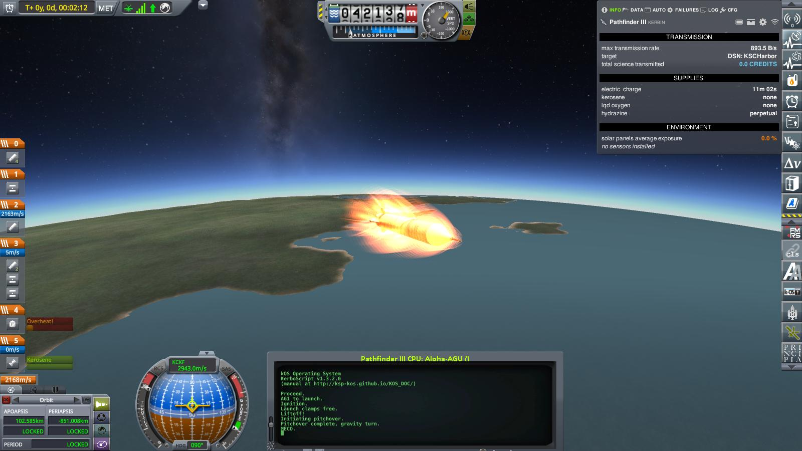

# Year 1, Day 89: Pathfinder III

Only 9 days after Pathfinder II, a new attempt at exploring the — still mysterious — radiation belt (belts?) around Kerbin is made. To that end, Pathfinder III carries a sophisticated ionization and static electricity analysis experiment which allows detailed measurements of the charged particles that supposedly make up these zones of high radiation that most scientists have started to call the "Kirbeland Belt" (Belts?).

A couple of minutes after noon on 001/089, Pathfinder III lifts off the pad at the Kerbinian Spaceport Complex:

The flight — guided by the automated program installed in the "Satevis" stage aviation guidance unit — starts out picture perfect: Liftoff, roll to correct orientation, pitchover maneuver, smooth transition to a zero-lift turn.

Further ascent, including some serious acceleration after passing the 20 kilometer mark (and having burnt most of the fuel on the first stage).

And finally — just as the heat from friction in the thin but still noticeable atmosphere starts to get a bit much for the fairing — main engine cutoff at 42 km above the ocean, exactly as planned.

As with the launches before it, the spent first stage and the fairing are carried on for a bit, both for protection of the payload, and to help keeping the rocket oriented along the flight path.

At an altitude of 70 km, the fairing is jettisoned.

Shortly after that, just as the upper stage separates from the spent booster stage, things start go wrong again: First a decoupler failure — but the backup decoupler that engineering insisted on _did_ fire. And then one of the two tiny rocket motors meant to shove the upper stage away from the spent booster stage failed. But the other one still provided enough thrust to get the upper stage clear of the booster. And finally, something seemed off with one of the batteries providing the electricity for the guidance computer — but there were still enough reserves to complete the mission.

Because of the pileup of near-fatal failures so far, and the fear that upper stage ignition might still fail as it did for Pathfinder II, the mood was a bit tense in mission control.

And the debate among a couple of spectators — which could be heard perfectly in the whole control room — as to wether the avoidance of a catastrophic failure so far was due to good planning or just plain luck did not really help. It _did_ lead to an immediate ban of all spectators in mission control though — much to the chagrin of the participants.

So, as Pathfinder III drifted to apoapsis, you could have heard a pin drop in mission control. And when the Satevis upper stage engine _did_ light off at apoapsis as planned, the cheers from mission control actually triggered an experimental new seismometer way over in the science center.

There _was_ another problem — a thrust instability — during the burn, but again, not fatal.

And the rest of the first part of the flight went of as planned again: Orient the craft normal to the orbital plane in order to get sun on the solar cells on Pathfinder III, spin up the craft to stabilize the orientation, release Pathfinder III to start its scientific mission, and finally shut down the avionics guidance core on the Satevis upper stage to conserve electricity.

The second part of the launch — deorbiting the Satevis upper stage by firing another set of tiny solid rockets at apoapsis — was still several hours away. So while the science team got busy setting up Pathfinder III for the first measurements, the team responsible for the Satevis stage went to the astronaut complex cafeteria for some well earned snacks.

In line at the kaffee dispenser, Max (who did handle telemetry for this launch) asked
> _ Say, Gene, did you notice the drop in signal strength from the Satevis after separation of Pathfinder III?
>  Sure, that is expected — just look at the specs for that puny builtin antenna in the Alpha-AGU, and compare it to the Pathfinder III antenna.

Having got their kaffee (they already had snacks), Gene an Max migrated to one of the cafeteria tables. Max seemed deep in thought, and — instead of paying proper attention to snacks and kaffee — started scribbling on a napkin.

A couple of minutes (and an absent-minded bite of Genes snack) later:

> _Gene, we may have a problem here._ \
> _Why?_ \
> _Well, according to this, we will lose contact with Satevis about halfway to apoapsis_ \
> _Yes, looks like it — but why is that a problem?_ \
> _Because we need to restart the guidance computer by radio signal for the deorbit maneuver. And we can do this only a couple of minutes before apoapsis, or the batteries won't last long enough._ \
> _———— !!!_

The ensuing, hastily assembled emergency brainstorming session came up with a plan:
* wait as long as signal strength allows to get as far along the trajectory as possible
* restore power to the guidance computer, and immediately send a signal to shut down the main guidance program, but leave the vessel orientation subroutines active.
* manually set the orientation target to prograde.
* as soon as the orientation stabilizes, send an override signal to manually fire the retro rockets.
* hope that this maneuver will lower the periapsis far enough that atmospheric drag will eventually deorbit the Satevis stage.

One hour and 10 minutes after liftoff, signal strength dropped dangerously low and the emergency plan was executed. And three minutes later, tracking confirmed that Satevis was indeed now on a suborbital trajectory, with a periapsis of 74 km.

-001:089-04:24:12.jpg)

And careful observation and tracking over the next couple of days confirmed that the almost negligible friction caused by the rarefied upper atmosphere was indeed sufficient to lower the apoapsis of the — now dead and inert — Satevis stage and its orbit would eventually decay enough so that it would burn up in the atmosphere as planned.

-001:092-03:05:21.png)

Meanwhile, Pathfinder III started its scientific mission. And preliminary results indicated that it was indeed radiation _belts_, plural.

And the analysis of the now so-called "antenna incident" finally concluded that the root cause had been a simple copying error — someone had accidentally used the antenna rating for the Pathfinder probe for calculating the radio reception range of the Alpha-AGU after separation from Pathfinder III. The recommended measure was to tighten up the review process for further mission plans.

----------------------------------------------------------------------------------
[next](../episode8/story.md)