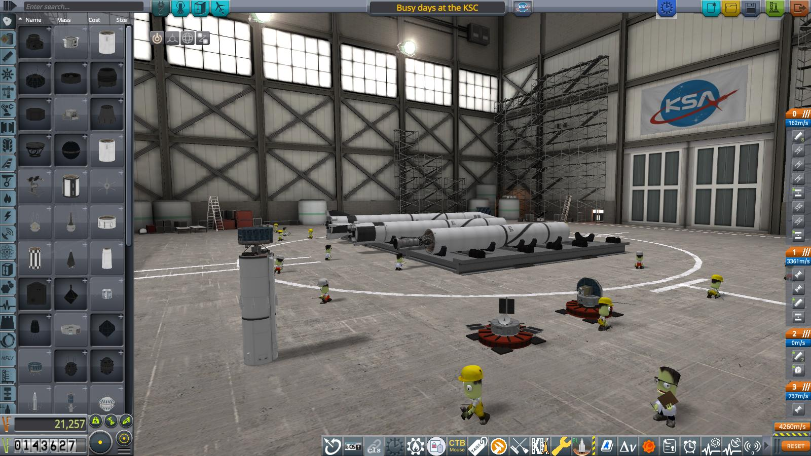

# Year 1, Day 100: Busy days at the KSC

Only 100 days after the Kerbinian Society for Astronavigation built its first rocket at the so called "Kerbin Spaceport Complex", the place was a beehive of activity. Almost living up to its grandiose new name, even.

The successes of the the KSA had sparked a huge interest in space flight and space exploration all over Kerbin. And the inevitable failures and mistakes (including the infamous "antenna incident") were seldom talked about even in the media, at least partially thanks to the newly appointed PR director of the society, Walt Kerman (yes, yet _another_ Kerman).

In consequence, several other institutions wanted satellites of their own, for a number of different reasons and projects.

A cooperation between meteorological institutes from universities across Kerbin managed to convince the "Research Advancement Division" (an organization dedicated to the "advancement of science" in general and well funded by a conglomerate of commercial interests and wealthy — in some cases _very_ wealthy — individuals) that a satellite (or better yet, multiple satellites) dedicated to studying Kerbins atmosphere would indeed advance science quite a bit (and also offer considerable commercial opportunities).

The department of astrophysics at a small (and up to now pretty unimportant) university went into a cooperation with a major industrial player to fund a satellite for observing the sun. Speculations as to how they managed this ran wild for quite a while, but finally it turned out to be the rather simple fact that the CEO of said corporation was an alumnus of said university, and had both the means to finance the research and the inclination to do so.

And finally, the venerable Kerbographic Society — the very institution responsible for mapping Kerbins oceans and most of its land masses back in the age of sail — embarked on a huge new project: Mapping not only Kerbin, but eventually _all_ major bodies in the Kerbolar system. The project would be handled by the newly founded Scientific Committee on Advanced Navigation within the Kerbographic Society.

So, a mere four munths after its first launch — and despite the fact of ongoing construction at the vehicle assembly building itself — the KSA was busy preparing not only one, but four new satellites for launch, all on the now tried and (mostly) true Sandstone/Satevis launch vehicle:

* Pathfinder IV (the replacement for the ill-fated Pathfinder II) was almost completed and scheduled to launch within the next 18 days.
* The first satellite dedicated to weather observation — with the rather uninspired name "weather imaging satellite one", or WIMAS I for short — was already mated to the "Satevis" second stage, and the "Sandstone" first stage was in final assembly.
* The first satellite for SCAN (named "KERMIT", officially as an abbreviation of "Kerbin mapping - initial topography", but according to persistent rumour actually after the main character in the favorite puppet show of the youngest grandchild of the chairwoman of the Kerbographic Society) was in final preparation for installing it on its "Satevis" stage.
* And finally, work had already begun on the "Kerbin Orbit Sun Observatory".

----------------------------------------------------------------------------------
[next](../episode10/story.md)